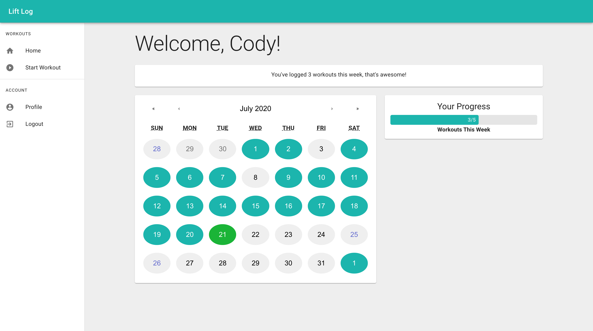

# Lift Log 💪
Lift Log is a web application and weightlifting tracker. Weightlifters no longer need to manually keep track of the amount of reps and sets after their workout. Lift Log automatically detects and logs exercises as you are working out.

Once logged in, you can view a calendar highlighting your workout history, as well as your progress toward your weekly workout goal. Hit the 'Start Workout' page and start up the camera to begin working out!

## Website
https://lift-log-pro.herokuapp.com/

## Install
npm install 
npm run start-dev 
view on localhost:8080 

## Stack
Lift Log’s responsive UI was built with React and Material UI. On the back end, we used Express to handle HTTP requests and Sequelize ORM for easy access to our PostgreSQL database, which consists of users, exercises, and set details so users can access their workout history. To train Lift Log to recognize exercises, we utilized Teachable Machine by Google, which uses Tensorflow and Posenet under the hood.
